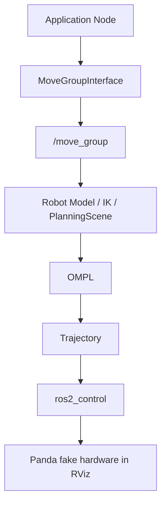
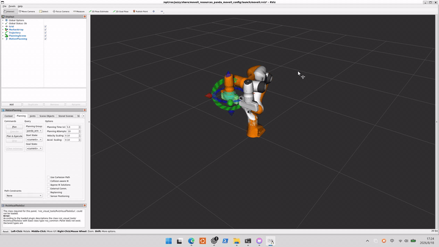

# MoveIt 2 Panda Learning Demo

A lightweight MoveIt 2 learning project using the Franka Panda robot in RViz. It demonstrates joint-space goal planning, pose goal planning, PlanningScene collision objects, and OMPL obstacle avoidance on Ubuntu 24.04, ROS 2 Jazzy, MoveIt 2, RViz2, and `ros2_control` fake hardware.

The repository contains only the learning/demo code built on top of ROS 2, MoveIt 2, and the official Panda resources. MoveIt, ROS 2, and Panda resources are provided by their respective projects.

## Features

1. **Joint Goal Planning**  
   Reads the current 7 Panda arm joints, changes `panda_joint1` by about `+0.3 rad`, plans with OMPL, and executes the trajectory.

2. **Pose Goal + IK**  
   Reads the current end-effector pose, moves the target pose upward by about `5 cm`, lets MoveIt solve the kinematics/IK goal, then plans and executes.

3. **PlanningScene + Obstacle Avoidance**  
   Adds a `demo_box` collision object to the PlanningScene, plans a collision-free motion with OMPL, executes it, and removes the object before exit.

## System Architecture



For more detail, see [docs/architecture.md](docs/architecture.md).

## Demo

Demo recordings are stored in [media/](media/).

### Joint Goal

[MP4](media/joint_goal_demo.mp4)

`joint_goal_demo` shows direct joint-space planning where the target joint vector is known.

### Pose Goal

[MP4](media/pose_goal_demo.mp4)

`pose_goal_demo` shows how a Cartesian end-effector pose target is converted by MoveIt into a valid robot state before motion planning.

### Obstacle Avoidance



[MP4](media/obstacle_avoidance_demo.mp4)

`planning_scene_obstacle_demo` is the main visual demo: a collision box is added to the PlanningScene and OMPL searches for a collision-free path around it.

### Overview

[MP4](media/overview_demo.mp4)

## Key Concepts

### MoveGroupInterface

The high-level C++ API used by application nodes to set goals, plan trajectories, and request execution.

### move_group

The core MoveIt ROS 2 backend node. It loads the robot model, monitors state, handles planning requests, manages the PlanningScene, and coordinates trajectory execution.

### Joint Goal

A joint goal directly specifies `q_goal`, the desired robot joint values. No end-effector pose-to-IK step is needed.

### Pose Goal

A pose goal specifies an end-effector pose. MoveIt uses kinematics/IK to find a legal joint state that satisfies the pose before planning.

### PlanningScene

MoveIt's internal world model containing the robot state, collision objects, and information needed for collision checking.

### OMPL

The Open Motion Planning Library provides sampling-based planners that search for collision-free paths in configuration space.

## MoveIt vs DLS IK

Damped Least Squares IK is local differential kinematics:

```text
Pose error -> Jacobian -> delta q
```

It is direct, interpretable, and useful for local continuous control or high-frequency online correction.

MoveIt + OMPL is global motion planning:

```text
start -> collision-aware search -> goal
```

It can use the PlanningScene, collision checking, and sampling-based search for global obstacle avoidance. They are complementary rather than replacements: MoveIt/OMPL can handle global collision-free motion, while Jacobian/DLS methods are suitable for local task-space control and online correction.

## Requirements

- Ubuntu 24.04
- ROS 2 Jazzy
- MoveIt 2
- RViz2
- `ros2_control` and `ros2_controllers`
- Official MoveIt Panda resources

This project was validated on WSL2 + WSLg, but it is a standard ROS 2 workspace and is not limited to WSL.

## Installation

Install the ROS 2 / MoveIt packages used by the demos:

```bash
sudo apt update
sudo apt install ros-jazzy-moveit
sudo apt install ros-jazzy-moveit-resources-panda-moveit-config
sudo apt install ros-jazzy-ros2-control ros-jazzy-ros2-controllers
```

## Build

Clone the repository and build it as a ROS 2 workspace:

```bash
source /opt/ros/jazzy/setup.bash
colcon build --symlink-install
source install/setup.bash
```

Or use:

```bash
./scripts/build.sh
```

## Run

Terminal 1:

```bash
source /opt/ros/jazzy/setup.bash
ros2 launch moveit_resources_panda_moveit_config demo.launch.py
```

Terminal 2:

```bash
source /opt/ros/jazzy/setup.bash
source install/setup.bash
ros2 run panda_moveit_learning joint_goal_demo
```

```bash
ros2 run panda_moveit_learning pose_goal_demo
```

```bash
ros2 run panda_moveit_learning planning_scene_obstacle_demo
```

Convenience scripts are also provided:

```bash
./scripts/launch_panda_demo.sh
./scripts/run_joint_goal_demo.sh
./scripts/run_pose_goal_demo.sh
./scripts/run_obstacle_demo.sh
```

## Troubleshooting

If a vendor library such as `libsdformat14.so.14` cannot be found, first confirm the ROS environment is sourced:

```bash
source /opt/ros/jazzy/setup.bash
echo "$LD_LIBRARY_PATH" | tr ':' '\n' | grep sdformat
```

Do not modify the official Panda URDF, SRDF, joint limits, controller configuration, kinematics settings, or self-collision matrix for these demos.

## License

This repository is released under the MIT License. ROS 2, MoveIt 2, OMPL, and Panda resources are provided by their respective projects and licenses.
