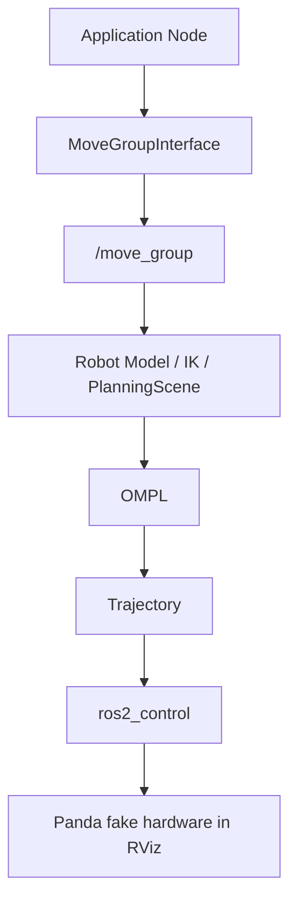

# MoveIt 2 Panda Learning Demo

[English](README.md) | [简体中文](README_zh-CN.md)

一个轻量级 MoveIt 2 学习与技能验证 Demo，在 RViz 中使用 Franka Panda 机器人，展示 joint-space goal planning、pose goal planning、PlanningScene collision objects，以及 OMPL obstacle avoidance。验证环境为 Ubuntu 24.04、ROS 2 Jazzy、MoveIt 2、RViz2 和 `ros2_control` fake hardware。

本仓库是学习 / 技能验证 Demo，而不是自定义生产级 MoveIt 2 stack。

仓库只包含基于 ROS 2、MoveIt 2 和官方 Panda resources 之上的学习 / demo 代码。MoveIt、ROS 2 和 Panda resources 均属于各自项目。

## Demo

主要可视化 Demo 是带 PlanningScene collision object 的避障规划：


其他录制文件位于 [media/](media/)。

## 功能

1. **Joint Goal Planning**  
   读取当前 7 个 Panda arm joints，将 `panda_joint1` 约增加 `+0.3 rad`，使用 OMPL 规划并执行轨迹。

2. **Pose Goal + IK**  
   读取当前末端执行器位姿，将目标位姿向上移动约 `5 cm`，由 MoveIt 求解满足该位姿的机器人状态，再规划并执行。

3. **PlanningScene + Obstacle Avoidance**  
   向 PlanningScene 添加 `demo_box` collision object，使用 OMPL 规划无碰路径，执行后删除该物体。

## 系统架构



更多细节见 [docs/architecture.md](docs/architecture.md)。

## 其他 Demo 录制

### Joint Goal

[MP4](media/joint_goal_demo.mp4)

`joint_goal_demo` 展示已知目标关节向量时的直接关节空间规划。

### Pose Goal

[MP4](media/pose_goal_demo.mp4)

`pose_goal_demo` 展示 MoveIt 如何将笛卡尔末端位姿目标转换为合法机器人状态，再进行运动规划。

### Obstacle Avoidance

[MP4](media/obstacle_avoidance_demo.mp4)

`planning_scene_obstacle_demo` 是主要可视化 Demo：向 PlanningScene 添加碰撞盒后，OMPL 搜索绕开障碍物的无碰路径。

### Overview

[MP4](media/overview_demo.mp4)

## 关键概念

### MoveGroupInterface

应用节点使用的高级 C++ API，用于设置目标、规划轨迹和请求执行。

### move_group

MoveIt ROS 2 后端核心节点。它加载机器人模型、监控状态、处理规划请求、管理 PlanningScene，并协调轨迹执行。

### Joint Goal

Joint goal 直接指定 `q_goal`，即目标关节值，不需要末端位姿到 IK 的步骤。

### Pose Goal

Pose goal 指定末端执行器位姿。MoveIt 使用运动学 / IK 找到满足该位姿的合法关节状态，然后进行规划。

### PlanningScene

MoveIt 的内部世界模型，包含机器人状态、碰撞物体，以及碰撞检测所需信息。

### OMPL

Open Motion Planning Library 提供基于采样的规划器，用于在 configuration space 中搜索无碰路径。

## MoveIt 与 DLS IK

Damped Least Squares IK 是局部微分运动学：

```text
Pose error -> Jacobian -> delta q
```

它直接、可解释，适合局部连续控制或高频在线修正。

MoveIt + OMPL 是全局运动规划：

```text
start -> collision-aware search -> goal
```

它可以使用 PlanningScene、碰撞检测和基于采样的搜索实现全局避障。两者是互补关系：MoveIt/OMPL 适合全局无碰运动，Jacobian/DLS 方法适合局部任务空间控制和在线修正。

## Requirements

- Ubuntu 24.04
- ROS 2 Jazzy
- MoveIt 2
- RViz2
- `ros2_control` and `ros2_controllers`
- Official MoveIt Panda resources

本项目在 WSL2 + WSLg 上验证过，但它是标准 ROS 2 workspace，不限于 WSL。

## Installation

安装 Demo 使用的 ROS 2 / MoveIt packages：

```bash
sudo apt update
sudo apt install ros-jazzy-moveit
sudo apt install ros-jazzy-moveit-resources-panda-moveit-config
sudo apt install ros-jazzy-ros2-control ros-jazzy-ros2-controllers
```

## Build

克隆仓库并作为 ROS 2 workspace 构建：

```bash
source /opt/ros/jazzy/setup.bash
colcon build --symlink-install
source install/setup.bash
```

也可以使用：

```bash
./scripts/build.sh
```

## Run

Terminal 1:

```bash
source /opt/ros/jazzy/setup.bash
ros2 launch moveit_resources_panda_moveit_config demo.launch.py
```

Terminal 2:

```bash
source /opt/ros/jazzy/setup.bash
source install/setup.bash
ros2 run panda_moveit_learning joint_goal_demo
```

```bash
ros2 run panda_moveit_learning pose_goal_demo
```

```bash
ros2 run panda_moveit_learning planning_scene_obstacle_demo
```

也提供便利脚本：

```bash
./scripts/launch_panda_demo.sh
./scripts/run_joint_goal_demo.sh
./scripts/run_pose_goal_demo.sh
./scripts/run_obstacle_demo.sh
```

## Troubleshooting

如果找不到 `libsdformat14.so.14` 等 vendor library，先确认 ROS 环境已经 source：

```bash
source /opt/ros/jazzy/setup.bash
echo "$LD_LIBRARY_PATH" | tr ':' '\n' | grep sdformat
```

本 Demo 不修改官方 Panda URDF、SRDF、joint limits、controller configuration、kinematics settings 或 self-collision matrix。

## 能力边界

本仓库支持展示：

- MoveGroupInterface
- joint-space goal
- pose goal
- PlanningSceneInterface / collision object
- OMPL obstacle avoidance
- RViz fake hardware

本仓库不声称：

- SO-101 MoveIt 2 集成
- MoveIt 2 真机部署
- 自定义 MoveIt Config
- MoveIt Servo
- MoveIt Task Constructor
- 自定义 planner

## License

本仓库使用 MIT License。ROS 2、MoveIt 2、OMPL 和 Panda resources 遵循各自项目与许可证。
