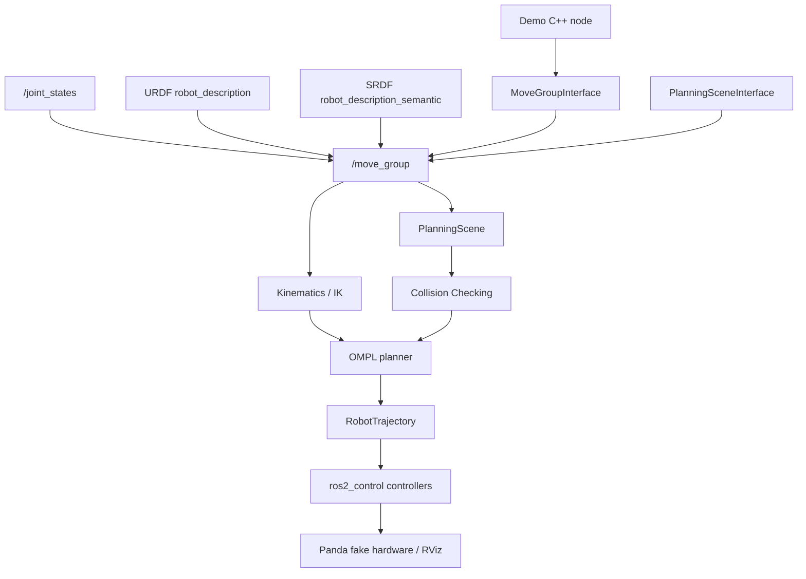

# Architecture

This project keeps the application layer intentionally small. Each executable is a ROS 2 C++ node that talks to MoveIt through `moveit::planning_interface::MoveGroupInterface`.

## Components

**ROS 2** provides the node graph, topics, services, actions, parameters, and launch system used by the demo.

**MoveGroupInterface** is the application-side C++ API used to set joint goals, pose goals, plan trajectories, and execute them.

**move_group** is the MoveIt backend node. It owns the planning pipeline, robot model, PlanningScene, collision checking, IK integration, and trajectory execution requests.

**URDF / SRDF** describe the Panda robot, planning groups, links, joints, and semantic MoveIt configuration. This repository does not modify official Panda resources.

**Joint States** provide the current Panda state to MoveIt and to the demo nodes.

**IK** is used when a pose goal is given. MoveIt searches for a valid joint state that satisfies the requested end-effector pose.

**PlanningScene** stores the robot state and collision world. The obstacle demo adds a `demo_box` collision object through `PlanningSceneInterface`.

**Collision Checking** rejects robot states or paths that intersect the environment or violate robot collision constraints.

**OMPL** searches configuration space for a collision-free path from the current robot state to the target state.

**Trajectory Execution** sends the planned `RobotTrajectory` to `ros2_control`, which drives the Panda fake hardware shown in RViz.
